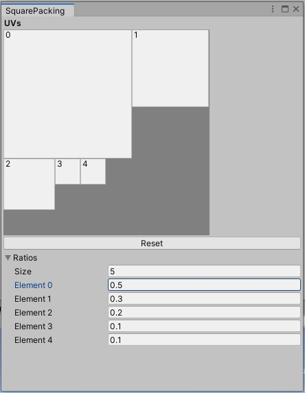

# Square-packing
 Packing squares inside a square for Unity in C#. 
 See Medium article https://medium.com/@vitefait/packing-squares-in-unity-52a1afbdf9c

Based on
https://github.com/TeamHypersomnia/rectpack2D#algorithm
and
https://blackpawn.com/texts/lightmaps/default.html

License
-------

[Public domain](http://unlicense.org/)
